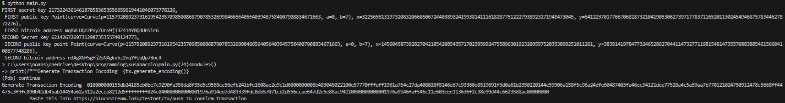
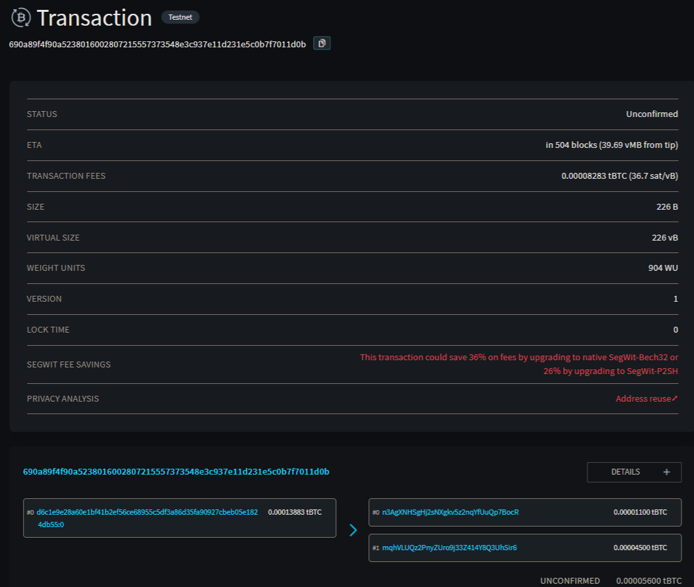

# Recreating Bitcoin From Scratch:

Currently this repository is capable of:
* Generating Public Keys from Private Keys:
* Generating Transaction Encodings, which can be pasted into https://blockstream.info/testnet/tx/push, to confirm transactions on-chain.

See Test Transaction at : https://blockstream.info/testnet/address/mqhVLUQz2PnyZUro9j33Z414Y8Q3UhSir6

Future Goals:
* Allow for mining
* Allow for hosting blockchain. 

References:
*  General: 
    *  Programming Bitcoin by Jimmy Song
        *  Repot: https://github.com/jimmysong/programmingbitcoin
    *  Andrej Karpathy: https://karpathy.github.io/2021/06/21/blockchain/
*  Transacting and signing: https://en.bitcoin.it/wiki/Main_Page
*  Elliptical Cryptographic Encryption: Andrea Corbellini, https://andrea.corbellini.name/2015/05/17/elliptic-curve-cryptography-a-gentle-introduction/
